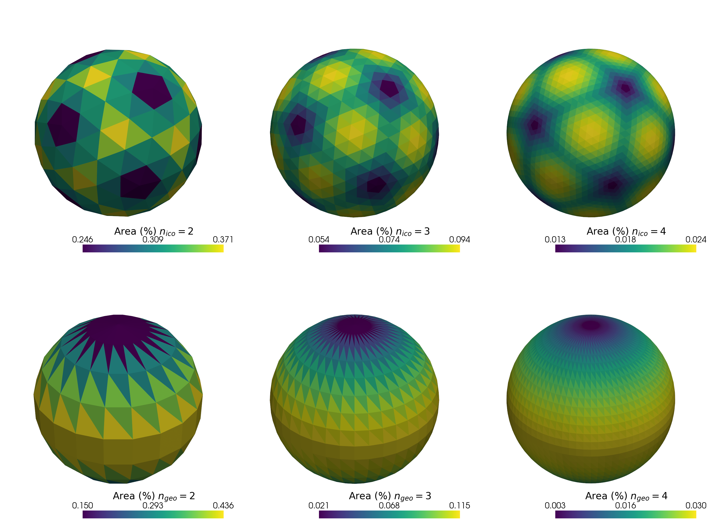
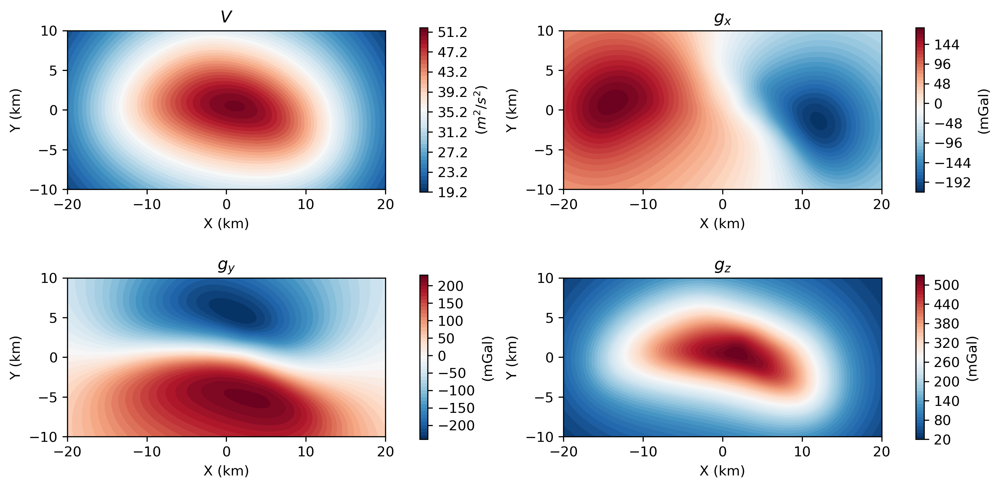
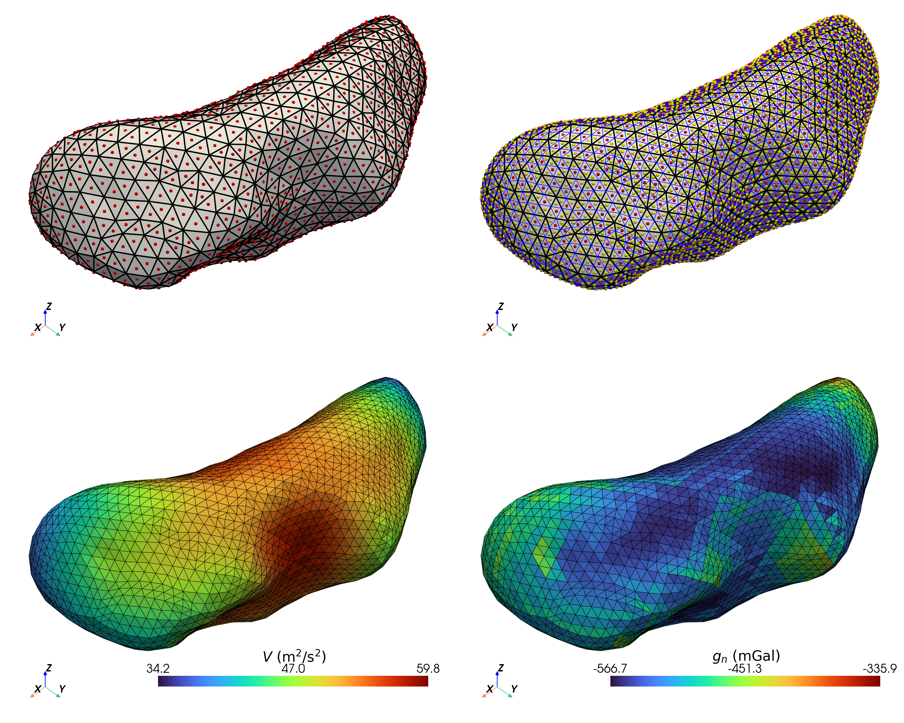
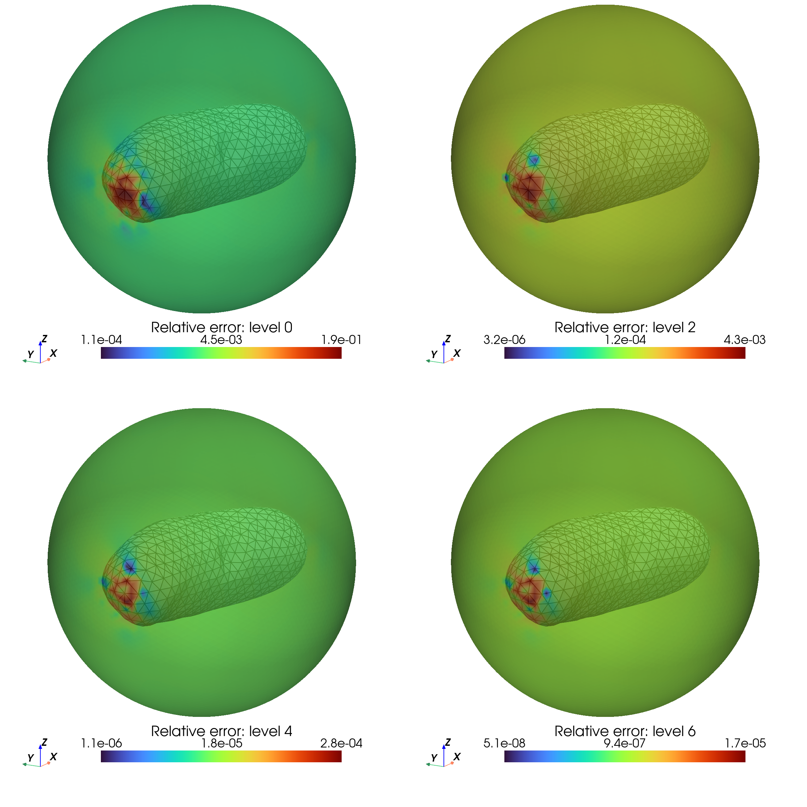
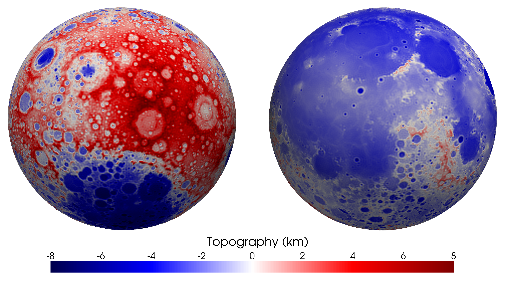
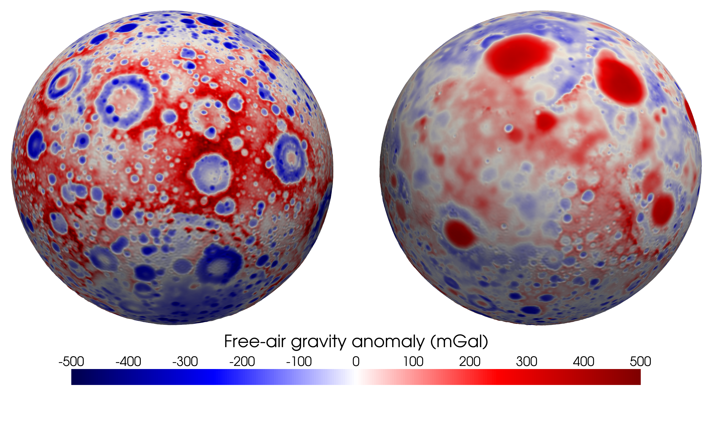

# VecWerSch: Vectorized/Parallel Polyhedral Gravitational Field Computation

[](https://www.python.org/)
[](https://opensource.org/licenses/MIT)
[](https://jupyter.org/)

Efficient Python implementation for computing gravitational fields of polyhedral bodies using Vectorized/Parallel algorithms. This repository provides tools for geophysical modelling, planetary science, and asteroid gravity analysis.

## 🌟 Features

- **Parallel Computation**: High-performance gravity field calculations using Numba
- **Polyhedral Models**: Support for complex 3D geometries approximated by polyhedrons
- **Multiple Coordinate Systems**: Local Cartesian and Global Spherical coordinates
- **Validation Tools**: Green's third identity verification for accuracy assessment
- **Real-world Examples**: Applications to asteroid EROS and Moon topography

## 📋 Table of Contents

- [Installation](#installation)
- [Benchmark](#-benchmark)
- [Numerical Examples](#-numerical-examples)

## 🚀 Installation

Clone the repository and install dependencies:

```bash
git clone https://github.com/LeyuanWu/VecWerSch.git
cd VecWerSch
conda install numpy numba matplotlib pyvista pygmt pyshtools
```

## 📊 Benchmark

<!--  -->
<div align="center">
  
  <p><em>Benchmark comparison of two algorithms</em></p>
</div>

## 🔬 Numerical Examples

### Sphere Approximation Methods
- [x] **Icosphere & Geosphere**: Two approaches to approximate spheres with polyhedrons
  - Recursive icosahedron subdivision
  - Triangulated geographic grid

<div align="center">
  
  <p><em>Icosphere vs. geosphere polyhedral approximations of an ideal sphere</em></p>
</div>

[View Sphere Polyhedron Example](https://github.com/LeyuanWu/VecWerSch/blob/main/ex_Sphere_Polyhedron.ipynb)

### Synthetic sphere modelling

[View Sphere gravity computation Example](https://github.com/LeyuanWu/VecWerSch/blob/main/ex_IcoGeoSphere_Global.ipynb)

### Asteroid EROS
- [x] **2D Plane Gravity Computation**: Gravitational anomalies on a 2D plane
- [x] **Green's Third Identity Validation**: Accuracy verification for polyhedral methods

<div align="center">
  
  <p><em>EROS gravity potential and vector on a 2D plane</em></p>
</div>

[View EROS: 2D plane computation](https://github.com/LeyuanWu/VecWerSch/blob/main/ex_EROS_2DPlane.ipynb)

<div align="center">
  
  <p><em>EROS geometry refinement with surface gravity</em></p>
</div>

[View EROS: mesh refinement and surface gravity](https://github.com/LeyuanWu/VecWerSch/blob/main/ex_EROS_GreenThirdID_1.ipynb)

<div align="center">
  
  <p><em>Numerical validation of Green's third ID across refinement levels</em></p>
</div>

[View EROS: Green's Third ID convergence](https://github.com/LeyuanWu/VecWerSch/blob/main/ex_EROS_GreenThirdID_2.ipynb)

### Moon Topography
- [x] **Moon Gravity Fields**: Comparison of polyhedral analytical vs. spherical harmonics methods

<div align="center">
  
  <p><em>Moon topography 3D view </em></p>
</div>

<div align="center">
  
  <p><em>3D view of Moon's Free-air gravity anomaly at r=1748 km </em></p>
</div>

[Moon topography & gravity overview](https://github.com/LeyuanWu/VecWerSch/blob/main/ex_Moon_TopoGrav_Data.ipynb)

[Moon topographic gravitational potential computation: SH](https://github.com/LeyuanWu/VecWerSch/blob/main/ex_Moon_TopoGrav_Comp_SH.ipynb)

## 🤝 Contributing

Contributions are welcome! Please feel free to submit a Pull Request.

## 📄 License

This project is licensed under the MIT License - see the [LICENSE](LICENSE) file for details.

## 👤 Author

**Leyuan Wu** - [GitHub](https://github.com/LeyuanWu)

---

*If you find this repository useful, please consider starring it on GitHub!* ⭐


