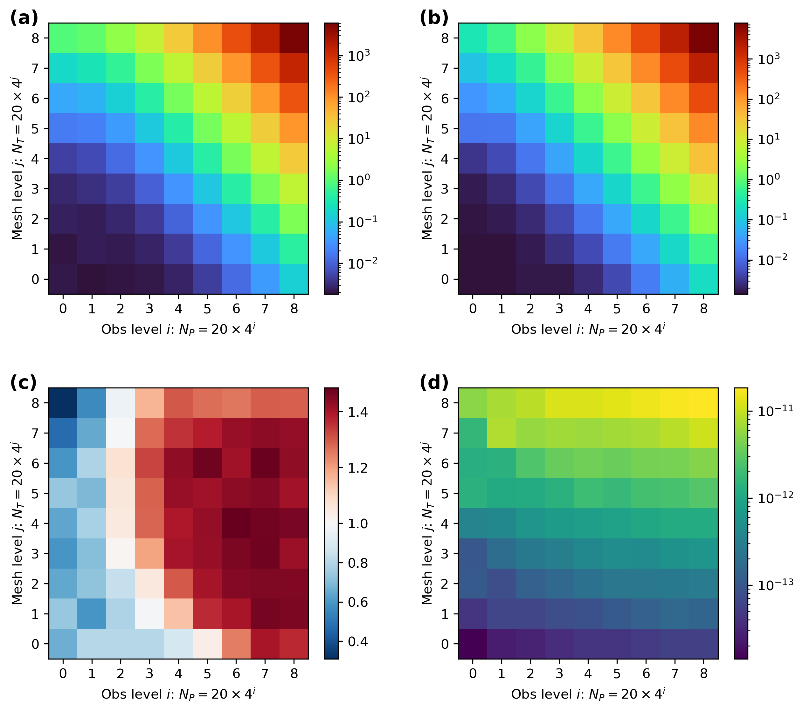
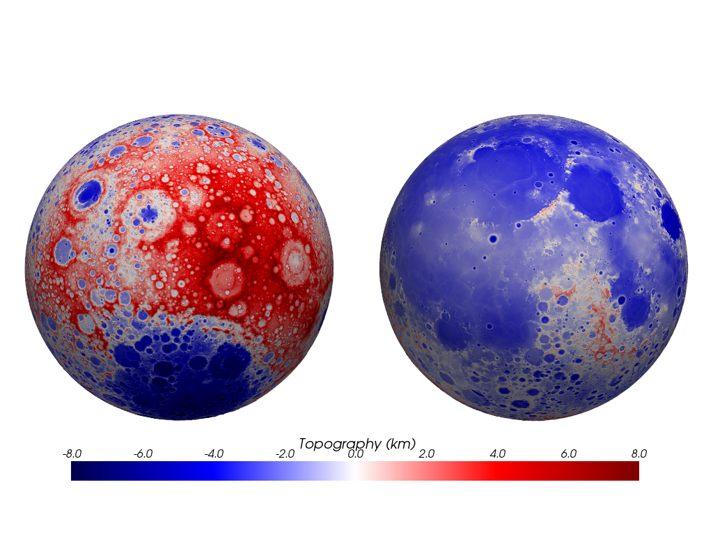

# VecWerSch: Vectorized/Parallel Polyhedral Gravitational Field Computation

[](https://www.python.org/)
[](https://opensource.org/licenses/MIT)
[](https://jupyter.org/)

Efficient Python implementation for computing gravitational fields of polyhedral bodies using Vectorized/Parallel algorithms. This repository provides tools for geophysical modelling, planetary science, and asteroid gravity analysis.

## 🌟 Features

- **Parallel Computation**: High-performance gravity field calculations using Numba
- **Polyhedral Models**: Support for complex 3D geometries approximated by polyhedrons
- **Multiple Coordinate Systems**: Local Cartesian and Global Spherical coordinates
- **Validation Tools**: Green's third identity verification for accuracy assessment
- **Real-world Examples**: Applications to asteroid EROS and Moon topography

## 📋 Table of Contents

- [Installation](#installation)
- [Benchmark](#benchmark)
- [Numerical Examples](#numerical-examples)
- [Contributing](#contributing)
- [License](#license)

## 🚀 Installation

Clone the repository and install dependencies:

```bash
git clone https://github.com/LeyuanWu/VecWerSch.git
cd VecWerSch
conda install numpy numba matplotlib pyvista pygmt pyshtools
```

## 📊 Benchmark



## 🔬 Numerical Examples

### Sphere Approximation Methods
- [x] **Icosphere & Geosphere**: Two approaches to approximate spheres with polyhedrons
  - Recursive icosahedron subdivision
  - Triangulated geographic grid


[View Sphere Polyhedron Example](https://github.com/LeyuanWu/VecWerSch/blob/main/ex_Sphere_Polyhedron.ipynb)

### Gravity Forward Modelling
- [x] **Local Cartesian Coordinates**: Local geophysical gravity exploration 
- [x] **Global Spherical Coordinates**: Large-scale planetary gravity fields

[View Local Coordinates Example](https://github.com/LeyuanWu/VecWerSch/blob/main/ex_IcoGeoSphere_Local.ipynb) | [View Global Coordinates Example](https://github.com/LeyuanWu/VecWerSch/blob/main/ex_IcoGeoSphere_Global.ipynb)

### Asteroid EROS Analysis
- [x] **2D Plane Gravity Computation**: Gravitational anomalies on planar surfaces
- [x] **Green's Third Identity Validation**: Accuracy verification for polyhedral methods


[View EROS 2D Example](https://github.com/LeyuanWu/VecWerSch/blob/main/ex_EROS_2DPlane.ipynb) | [View Green's Identity Example](https://github.com/LeyuanWu/VecWerSch/blob/main/ex_EROS_GreenThirdID_Comp.ipynb)

### Lunar Topography
- [x] **Moon Gravity Fields**: Comparison of polyhedral analytical vs. spherical harmonics methods



[View Moon Topography Example](https://github.com/LeyuanWu/VecWerSch/blob/main/ex_Moon_TopoGrav_Data.ipynb)

## 🤝 Contributing

Contributions are welcome! Please feel free to submit a Pull Request.

## 📄 License

This project is licensed under the MIT License - see the [LICENSE](LICENSE) file for details.

## 👤 Author

**Leyuan Wu** - [GitHub](https://github.com/LeyuanWu)

---

*If you find this repository useful, please consider starring it on GitHub!* ⭐


